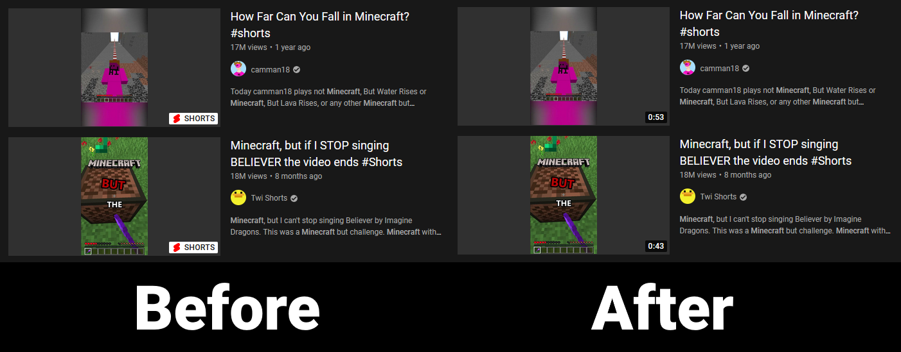

# YouTube Anti-Shorts

A simple userscript to remove the Shorts feature from YouTube.

# What does this do?

This script redirects all `/shorts/` URLs on YouTube to `/watch`.

It also converts all Shorts renderers to regular ones, making their timestamps show instead of the shorts sign.

# Installation

First, you will need to install a userscript manager, such as [Tampermonkey](https://www.tampermonkey.net/) or [Violentmonkey](https://violentmonkey.github.io/).

Then, open the following link:

### [Install the script (requires a userscript manager)](https://github.com/YukisCoffee/yt-anti-shorts/raw/main/anti-shorts.user.js)

# To do

As it stands, this script removes Shorts video renderers from the page and attempts to redirect all URLs. There are still a few locations that this behaviour does not occur:

- The Shorts guide item
- Shorts video renderers on channel homepages
